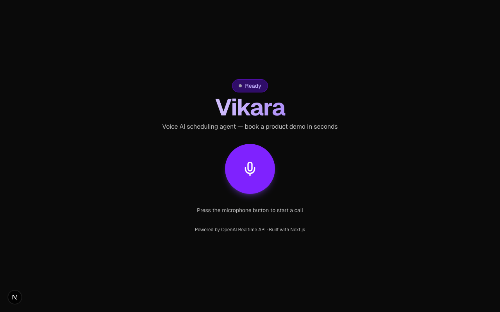

# Vikara — Voice AI Scheduling Agent

A real-time voice agent that helps you schedule product demos in seconds. Built with the OpenAI Realtime API and Next.js.

## Features

- **Voice-first scheduling** — speak naturally to book a 30-minute product demo
- **Real-time audio visualization** — Web Audio API-driven visualizer for both mic input and agent output
- **Smart date handling** — understands relative dates ("next Friday"), verifies with exact dates, and suggests times
- **Calendar invites** — sends `.ics` calendar invites via email with accept/decline buttons
- **Agent-initiated call ending** — the agent says goodbye and hangs up when the conversation is done


## Tech Stack

- [Next.js](https://nextjs.org) 16 (App Router)
- [OpenAI Agents SDK](https://github.com/openai/openai-agents-js) (`@openai/agents`) with Realtime API
- WebRTC transport with Web Audio API visualization
- [Resend](https://resend.com) for email delivery
- Tailwind CSS v4

## Getting Started

```bash
pnpm install
```

Create a `.env.local` file:

```
OPENAI_API_KEY=sk-...
RESEND_API_KEY=re_...
```

Run the dev server:

```bash
pnpm dev
```

Open [http://localhost:3000](http://localhost:3000) and click the microphone to start a call.

## How It Works

1. User clicks the mic button to start a call
2. The app creates an ephemeral OpenAI Realtime API session via a server action
3. A WebRTC connection is established with the OpenAI Realtime API
4. The agent greets the user and collects a date, time, name, and email
5. The `schedule_demo` tool sends a calendar invite via Resend
6. The agent confirms and ends the call with the `end_call` tool

## License

MIT
